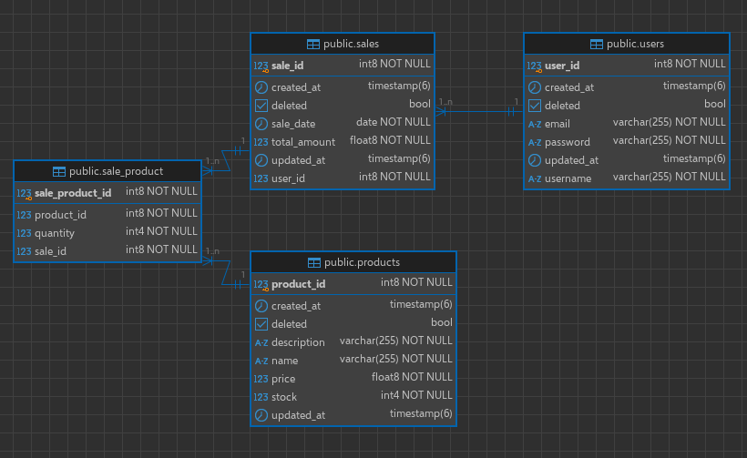

# simple-ecommerce

## Diagrama ER

## Como rodar

Crie uma cópia do arquivo `.env.example` com o nome de `.env`.

Suba o banco de dados.
~~~shell
docker compose up
~~~

Excecute a aplicação.
~~~shell
./gradlew Bootrun
~~~